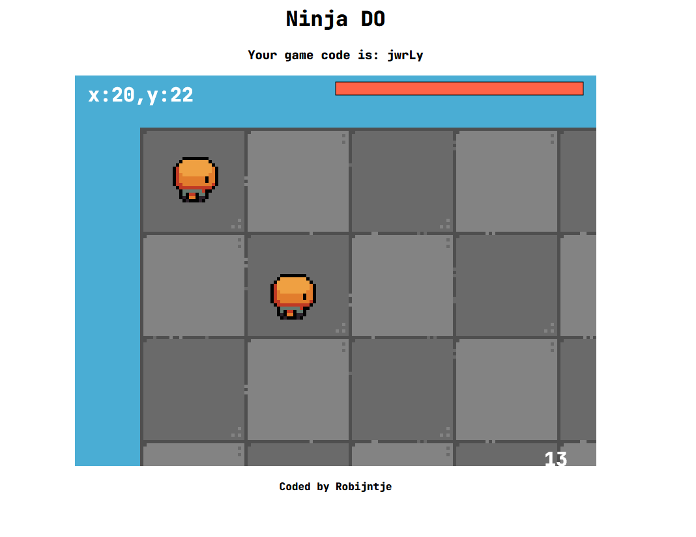
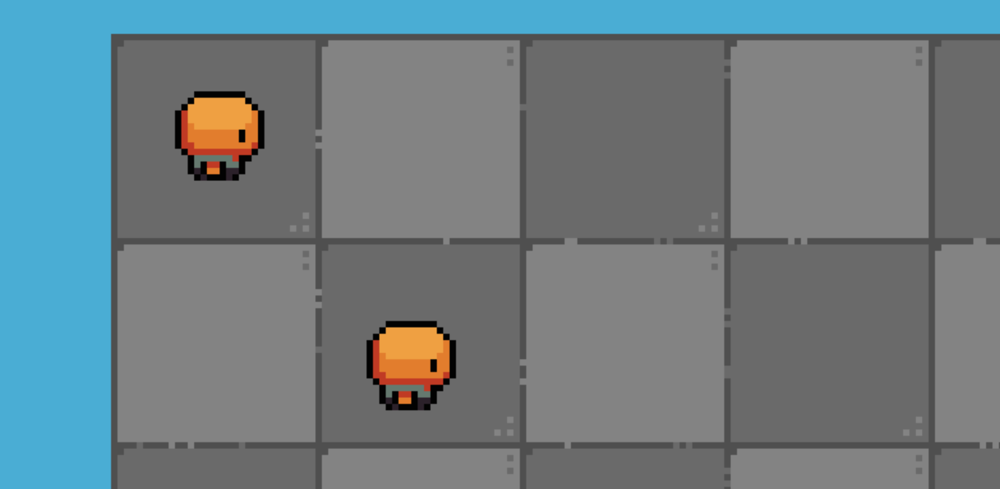

# NinjaDO

Simple game written in JS. It now supports multiplayer too.
This is just a little personal project of mine.

## Installation

The game uses a server and a client. You need a server to run it. It should work on your local network. Just download the server file, and run it. It should tell you the IP adress you need to connect to.
After you started the server, you should be able to open the index.html file. Enter the IP adress, and you are ready to go!

### Singleplayer version

I started this project with a singleplayer version. It is much simpeler (and uses the old assets), and lives in the [singleplayer branch](https://github.com/RobinBoers/NinjaDO/tree/singleplayer).  
It doesn't require installation at all, because it doesn't need a server.  
You can just play it [in your browser](https://code.geheimesite.nl/beta/NinjaDO/singleplayer/)! There is not much to do tough...

## Thanks

I used [these](https://github.com/sparklinlabs/superpowers-asset-packs/tree/master/ninja-adventure) great assets from [Superpowers](http://superpowers-html5.com/), and I reallt like them. If you need any good assets for your project, be sure to check it out!  
I also want to thank [this CoderDojo Nano book](https://www.amazon.com/CoderDojo-Nano-Make-Your-Create/dp/1338157574) for bringing me the original idea, and helping me learn Javascript in the first place.

