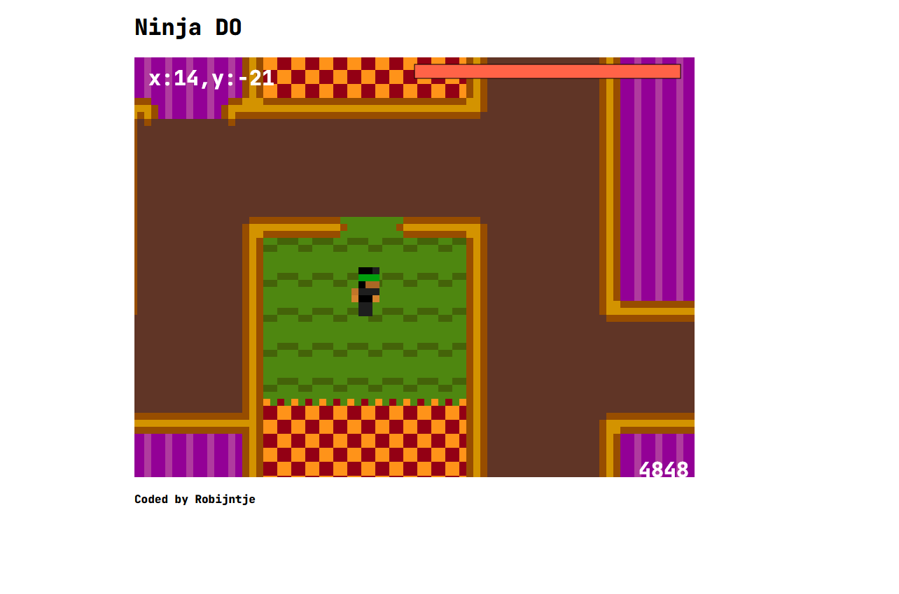

# NinjaDO

Simple game written in JS. It now supports multiplayer too.
This is just a little personal project of mine.

## Installation

I'm working on a simple executable file which just works, but for now you needto run it yourself using node.js<br>
To run the code, make sure you installed node.js<br>
Then start the server with ```node server.js```.
After you started the server, you should be able to open the index.html file.


